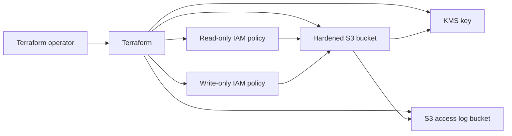

# IAM and S3 Hardening with Terraform

This project builds a secure AWS S3 storage baseline and least-privilege IAM policies using Terraform. It is designed as a cloud security portfolio lab, with safe defaults and no committed secrets.

## What This Builds

| Area | Security Control |
| --- | --- |
| S3 exposure | Blocks public ACLs and public bucket policies |
| Encryption | Uses a dedicated KMS key with key rotation enabled |
| Transport security | Denies non-TLS bucket access |
| Upload security | Denies unencrypted object uploads |
| Data recovery | Enables S3 versioning |
| Audit trail | Supports S3 server access logging |
| IAM | Creates separate read-only and write-only least-privilege policies |
| Public repo safety | Ignores state, tfvars, credentials, private keys, and kubeconfig files |

## Architecture



## Repository Structure

```text
.
├── main.tf
├── versions.tf
├── variables.tf
├── outputs.tf
├── examples/
│   └── terraform.tfvars.example
├── modules/
│   ├── iam-least-privilege/
│   └── secure-s3/
└── docs/
    └── security-controls.md
```

## Usage

Copy the example variables file locally. Do not commit your real `.tfvars` file.

```bash
cp examples/terraform.tfvars.example terraform.tfvars
terraform init
terraform fmt -recursive
terraform validate
terraform plan
```

Only run `terraform apply` in a lab AWS account where you understand the cost and security impact.

## Public Repo Safety

Never commit:

- AWS access keys or secret keys
- `.env` files
- `.tfvars` files with real values
- Terraform state files
- private keys such as `.pem`, `.key`, or `id_rsa`
- kubeconfig files
- real production account IDs, passwords, tokens, or webhook URLs

## Portfolio Talking Points

- Shows least privilege instead of broad `s3:*` access.
- Demonstrates secure storage defaults: private access, encryption, versioning, TLS-only access, and logging.
- Separates reusable Terraform modules from root configuration.
- Includes a CI workflow for Terraform formatting, validation, Checkov scanning, and secret scanning.
